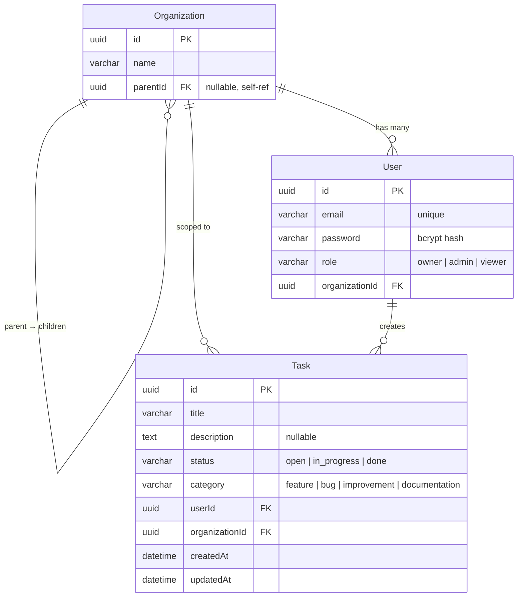

# Secure Task Management System

A full-stack task management platform built with an **NX monorepo**, **NestJS** backend, **Angular** frontend, **TypeORM + SQLite** persistence, and **TailwindCSS** styling. The system features JWT authentication, role-based access control (RBAC) with organization-level scoping, a Kanban board with drag-and-drop, dark mode, keyboard shortcuts, and a **fully responsive design** (mobile to desktop).

---

## Table of Contents

1. [Setup Instructions](#setup-instructions)
2. [Architecture Overview](#architecture-overview)
3. [Data Model Explanation](#data-model-explanation)
4. [Access Control Implementation](#access-control-implementation)
5. [API Documentation](#api-documentation)
6. [Testing](#testing)
7. [Future Considerations](#future-considerations)
8. [Tradeoffs & Deviations](#tradeoffs--deviations)

---

## Setup Instructions

### Prerequisites

- **Node.js** ≥ 18
- **npm** ≥ 9

### 1. Install Dependencies

```bash
npm install
```

### 2. Seed the Database

The project uses SQLite, so there is no external database to configure. Run the seed script to create sample organizations, users, and tasks:

```bash
npx tsx apps/api/src/seed.ts
```

This creates the `db/taskmanager.db` file with pre-populated data.

### 3. Start the Backend (NestJS API)

```bash
npx nx serve api
```

The API server starts on **http://localhost:3000/api**.

### 4. Start the Frontend (Angular Dashboard)

```bash
npx nx serve dashboard
```

The dashboard is available at **http://localhost:4200**.

### Environment Configuration

The project uses a local SQLite database file (`db/taskmanager.db`) and a default JWT secret for ease of evaluation. No `.env` file is required to get started. The relevant defaults are:

| Variable       | Default Value                      | Location                  |
| -------------- | ---------------------------------- | ------------------------- |
| `JWT_SECRET`   | `dev-secret-change-in-production`  | `apps/api/src/app/auth/jwt.strategy.ts` |
| SQLite DB path | `db/taskmanager.db`                | `apps/api/src/app/app.module.ts`        |

> **Note:** In production, set `JWT_SECRET` via an environment variable and replace SQLite with a production-grade database.

### Seeded Login Credentials

| Email               | Password    | Role    | Organization |
| ------------------- | ----------- | ------- | ------------ |
| `owner@acme.com`    | `owner123`  | Owner   | Acme Corp    |
| `admin@acme.com`    | `admin123`  | Admin   | Acme Corp    |
| `viewer@acme.com`   | `viewer123` | Viewer  | Acme Corp    |
| `admin@globex.com`  | `globex123` | Admin   | Globex Inc   |

---

## Architecture Overview

### NX Monorepo Structure

```
├── apps/
│   ├── api/            ← NestJS backend (REST API, auth, RBAC)
│   └── dashboard/      ← Angular frontend (Kanban board, auth UI)
├── libs/
│   └── shared/
│       ├── data/       ← TypeScript interfaces, DTOs, enums (Role, TaskStatus, TaskCategory)
│       └── auth/       ← Reusable RBAC logic (@Roles decorator, RolesGuard, ROLES_KEY)
├── db/                 ← SQLite database file (auto-created)
└── audit.log           ← File-based audit trail (auto-created)
```

### Why NX?

The NX monorepo provides several key advantages:

1. **Single source of truth for types** — The `shared/data` library exports `Role`, `TaskStatus`, `TaskCategory` enums, and `ICreateTask`/`IUpdateTask` interfaces. Both the NestJS API and Angular dashboard import from the same package (`@turbomonorepo/shared-data`), ensuring compile-time type safety across the stack.

2. **Shared auth logic** — The `shared/auth` library contains the `@Roles()` decorator and the `ROLES_KEY` metadata constant. The NestJS `RolesGuard` reads this metadata to enforce route-level permissions. This allows RBAC decorators to be reused across any number of backend controllers without duplication.

3. **Clean separation of concerns** — Each application (`api`, `dashboard`) owns its domain logic, while shared libraries form the contract layer. This prevents circular dependencies and makes each piece independently testable.

4. **Unified tooling** — A single `npm install`, and `nx test`, `nx serve`, `nx lint` commands work across the entire workspace with consistent configuration.

### Responsive Design

The dashboard is **fully responsive** from mobile (≈320 px) to desktop, built with a **mobile-first** approach using Tailwind CSS responsive breakpoints (`sm:`, `md:`, `lg:`).

| Concern | Mobile | Desktop |
| --- | --- | --- |
| **Kanban columns** | Stack vertically in a single column | Side-by-side three-column grid (`grid-cols-1 md:grid-cols-3`) |
| **Page header** | Stacks title, filters, and action button vertically (`flex-col`) | Horizontal row (`sm:flex-row`) |
| **Task form modal** | Bottom-sheet pattern — slides up from the bottom, full-width with rounded top corners (`rounded-t-xl`, `items-end`) | Centered floating dialog with rounded corners (`sm:rounded-xl`, `sm:items-center`, `sm:max-w-lg`) |
| **Form buttons** | Full-width, stacked vertically (`flex-col-reverse`, `w-full`) | Inline side-by-side (`sm:flex-row`, `sm:w-auto`) |
| **Typography** | Compact sizes (`text-xl`, `text-xs`) | Larger sizes (`sm:text-2xl`, `sm:text-sm`) |
| **Touch targets** | Larger hit areas on card action buttons (`p-1.5`) | Standard padding (`sm:p-1`) |
| **Drop zones** | Shorter minimum height (`min-h-[120px]`) | Taller (`md:min-h-[200px]`) |
| **Scrolling** | Modal content scrollable within viewport (`max-h-[90vh] overflow-y-auto`) | Same constraint, rarely needed |

All responsive behaviour is achieved exclusively through Tailwind utility classes — no custom media queries or JavaScript resize listeners are required.

---

## Data Model Explanation

### Entities

| Entity           | Key Columns                                                                 |
| ---------------- | --------------------------------------------------------------------------- |
| **Organization** | `id` (UUID), `name`, `parentId` (nullable, self-referencing FK for 2-level hierarchy) |
| **User**         | `id` (UUID), `email` (unique), `password` (bcrypt hash), `role` (Owner/Admin/Viewer), `organizationId` (FK) |
| **Task**         | `id` (UUID), `title`, `description` (nullable), `status` (open/in_progress/done), `category` (feature/bug/improvement/documentation), `userId` (FK), `organizationId` (FK), `createdAt`, `updatedAt` |

### Entity Relationship Diagram



### Key Relationships

- **Organization → Organization** — Self-referencing `parentId` enables a two-level hierarchy (e.g., "Acme Corp" → "Acme Veterinary"). Top-level organizations have `parentId = null`.
- **Organization → User** — Each user belongs to exactly one organization.
- **Organization → Task** — Tasks are scoped to an organization. Users can only see tasks belonging to their own `organizationId`.
- **User → Task** — Each task tracks which user created it via `userId`.

---

## Access Control Implementation

### Authentication: JWT

1. **Login** — `POST /api/auth/login` accepts `email` and `password`, validates credentials via `bcrypt.compare`, and returns a signed JWT (1-hour expiry).
2. **Token payload** — Contains `sub` (userId), `role`, and `organizationId`.
3. **Verification** — Every protected endpoint applies the `JwtAuthGuard` (Passport JWT strategy) which extracts the Bearer token, verifies its signature against `JWT_SECRET`, and attaches the decoded payload to `request.user`.
4. **Frontend** — The Angular `AuthInterceptor` automatically attaches the stored JWT to every outgoing HTTP request via the `Authorization: Bearer <token>` header. The `AuthGuard` on the `/tasks` route redirects unauthenticated users to `/login`.

### Authorization: RBAC with Role Hierarchy

The system implements a **hierarchical role model**:

```
Owner (rank 3)  >  Admin (rank 2)  >  Viewer (rank 1)
```

**How it works:**

1. The `@Roles(Role.Owner, Role.Admin)` decorator (from `@turbomonorepo/shared-auth`) marks which roles are required for a route.
2. The `RolesGuard` reads the `@Roles()` metadata, computes the minimum required rank, and compares it against the authenticated user's role rank.
3. A higher-ranked role **inherits** all permissions of lower-ranked roles. An Owner can do everything an Admin can, and an Admin can do everything a Viewer can.

**Permission matrix:**

| Action                | Owner | Admin | Viewer |
| --------------------- | :---: | :---: | :----: |
| View tasks (`GET`)    |  ✅   |  ✅   |   ✅   |
| Create task (`POST`)  |  ✅   |  ✅   |   ❌   |
| Edit task (`PUT`)     |  ✅   |  ✅   |   ❌   |
| Delete task (`DELETE`) |  ✅   |  ✅   |   ❌   |
| View audit log        |  ✅   |  ✅   |   ❌   |

### Organization-Level Scoping

All task queries are filtered by `organizationId` from the JWT payload. A user in "Acme Corp" can never see or modify tasks belonging to "Globex Inc", regardless of their role. This scoping is enforced at the service layer (`task.service.ts`), not just at the controller level.

---

## API Documentation

All endpoints are prefixed with `/api`. Protected endpoints require `Authorization: Bearer <token>`.

### `POST /api/auth/login`

Authenticate and receive a JWT.

**Request:**
```json
{
  "email": "owner@acme.com",
  "password": "owner123"
}
```

**Response (200):**
```json
{
  "access_token": "eyJhbGciOiJIUzI1NiIsInR5cCI6IkpXVCJ9..."
}
```

---

### `POST /api/tasks`

Create a new task. **Requires:** Owner or Admin role.

**Request:**
```json
{
  "title": "Fix login page CSS",
  "description": "The login button overflows on mobile devices",
  "status": "open",
  "category": "bug"
}
```

**Response (201):**
```json
{
  "id": "a1b2c3d4-e5f6-7890-abcd-ef1234567890",
  "title": "Fix login page CSS",
  "description": "The login button overflows on mobile devices",
  "status": "open",
  "category": "bug",
  "userId": "u1234567-89ab-cdef-0123-456789abcdef",
  "organizationId": "o1234567-89ab-cdef-0123-456789abcdef",
  "createdAt": "2026-03-02T08:00:00.000Z",
  "updatedAt": "2026-03-02T08:00:00.000Z"
}
```

---

### `GET /api/tasks`

List all tasks in the authenticated user's organization.

**Response (200):**
```json
[
  {
    "id": "a1b2c3d4-e5f6-7890-abcd-ef1234567890",
    "title": "Fix login page CSS",
    "description": "The login button overflows on mobile devices",
    "status": "open",
    "category": "bug",
    "userId": "u1234567-89ab-cdef-0123-456789abcdef",
    "organizationId": "o1234567-89ab-cdef-0123-456789abcdef",
    "createdAt": "2026-03-02T08:00:00.000Z",
    "updatedAt": "2026-03-02T08:00:00.000Z"
  }
]
```

---

### `PUT /api/tasks/:id`

Update an existing task. **Requires:** Owner or Admin role.

**Request:**
```json
{
  "status": "in_progress",
  "title": "Fix login page CSS (urgent)"
}
```

**Response (200):** Returns the updated task object.

---

### `DELETE /api/tasks/:id`

Delete a task. **Requires:** Owner or Admin role.

**Response (200):** Returns the deleted task object.

---

### `GET /api/audit-log`

Retrieve the file-based audit trail. **Requires:** Owner or Admin role.

**Response (200):**
```
[2026-03-02T08:00:00.000Z] [AUDIT] User [u123] created Task [t456] in Org [o789]
[2026-03-02T08:01:00.000Z] [AUDIT] User [u123] updated Task [t456] in Org [o789]
```

---

## Testing

The project includes **164 tests** across the full stack.

### Run All Tests

```bash
# Backend (Jest) — 61 tests across 9 suites
npx nx test api

# Frontend (Vitest) — 103 tests across 8 suites
npx nx test dashboard
```

### Test Coverage Breakdown

| Suite                           | Tests | Framework |
| ------------------------------- | ----: | --------- |
| Task Controller (API)           |    12 | Jest      |
| Task Service (API)              |    12 | Jest      |
| Auth Controller (API)           |     7 | Jest      |
| Auth Service (API)              |     9 | Jest      |
| Audit Log Controller (API)      |     6 | Jest      |
| Audit Log Service (API)         |     3 | Jest      |
| Entity specs (User, Org, Task)  |    12 | Jest      |
| TaskListComponent (Dashboard)   |    50 | Vitest    |
| TaskFormComponent (Dashboard)   |    21 | Vitest    |
| AuthService (Dashboard)         |    12 | Vitest    |
| LoginComponent (Dashboard)      |     8 | Vitest    |
| TaskService (Dashboard)         |     7 | Vitest    |
| AuthGuard (Dashboard)           |     2 | Vitest    |
| AuthInterceptor (Dashboard)     |     2 | Vitest    |
| AppComponent (Dashboard)        |     1 | Vitest    |

---

## Future Considerations

### Advanced Role Delegation

The current three-tier hierarchy (Owner > Admin > Viewer) is effective for task management, but real-world scenarios often require finer-grained permission boundaries. For example:

- **Billing vs. operational access** — An Owner may need exclusive access to billing, subscription management, and organization settings, while Admins handle day-to-day task operations. This could be implemented by introducing a **permissions bitmask** or a **claims-based** model where each role maps to a set of discrete capabilities (`tasks:write`, `billing:read`, `org:manage`), rather than a single rank.
- **Custom roles** — Allow organization Owners to define custom roles with hand-picked permissions, stored in a `role_permissions` join table.

### JWT Refresh Tokens

The current implementation issues a single access token with a 1-hour expiry. For improved security and UX:

- Issue a short-lived **access token** (15 minutes) alongside a long-lived **refresh token** (7 days) stored in an `HttpOnly` cookie.
- Add a `POST /auth/refresh` endpoint that validates the refresh token, rotates it (one-time use), and returns a fresh access token.
- Implement a **token revocation list** (Redis-backed) to invalidate refresh tokens on logout or password change.
- On the Angular side, the `AuthInterceptor` would detect `401` responses and transparently retry the original request after refreshing the token.

### CSRF Protection

Since the Angular app communicates via `Authorization: Bearer` headers (not cookies), the API is inherently resistant to CSRF attacks — browsers do not auto-attach custom headers on cross-origin requests. However, if refresh tokens are moved to `HttpOnly` cookies:

- Enable the **Double Submit Cookie** pattern: the server sets a CSRF token cookie, and the Angular app reads it and sends it back in a custom header (`X-CSRF-Token`) on state-changing requests.
- NestJS provides the `csurf` middleware (or the more modern `csrf-csrf` package) to validate the token server-side.
- Configure strict `SameSite=Strict` and `Secure` flags on all cookies.

### RBAC Caching for Scaling

The current `RolesGuard` reads the user's role from the JWT payload on every request, which is inherently fast (no DB lookup). As the system scales to support fine-grained permissions:

- **Cache permission sets in Redis** — On login, resolve the user's full permission set and store it in Redis keyed by `userId`. The guard checks Redis instead of performing a database join on every request.
- **Cache invalidation** — When an admin changes a user's role, publish an event (via Redis Pub/Sub or a message queue) to invalidate that user's cached permissions.
- **JWT claims enrichment** — For read-heavy workloads, embed a permission hash in the JWT. The guard compares this hash against the cached version; if they match, skip the lookup entirely.
- **Edge caching** — At scale, deploy an API gateway (e.g., Kong, AWS API Gateway) that validates JWTs and enforces coarse-grained RBAC at the edge, reducing load on application servers.

---

## Tradeoffs & Deviations

A few implementation choices intentionally deviate from the literal spec wording. Each is explained below.

### Shared Library Path (`libs/shared/` vs `libs/`)

The spec suggests `libs/data/` and `libs/auth/`. This project nests them under `libs/shared/data/` and `libs/shared/auth/`. The extra `shared/` grouping keeps the `libs/` folder organized — if additional non-shared libraries (e.g., a UI component library or a server-only utility) were added later, they would sit alongside `shared/` rather than mixing with it at the same level.

### Permissions Model (Implicit Hierarchy vs Dedicated Entity)

The spec lists "Permissions" as a data model. Instead of a separate `permissions` table with explicit permission rows, this project derives permissions from a **role hierarchy rank** (`Owner=3 > Admin=2 > Viewer=1`) inside the `RolesGuard`. This was chosen because:

- The three-role model maps cleanly to a numeric rank, making the guard a single comparison (`userRank >= minRequiredRank`).
- A dedicated permissions table adds join overhead and migration complexity with no practical benefit when the permission set is static and small.
- The README's [Future Considerations](#future-considerations) section describes how to evolve toward a fine-grained permissions/claims model if needed.

### Task Categories (Domain-Specific vs Generic)

The spec example uses "Work, Personal" as categories. This project uses `bug`, `feature`, `improvement`, and `documentation` — categories that align with a **task management / issue tracker** domain. The categorization feature (filter dropdown, category badges, color-coded pills) is fully implemented; only the label values differ to better fit the system's purpose.

### Frontend Test Runner (Vitest vs Jest/Karma)

The spec suggests Jest or Karma for frontend tests. This project uses **Vitest**, which is the default test runner scaffolded by NX for Angular projects using the Vite build pipeline. Vitest was kept because:

- It is API-compatible with Jest (`describe`, `it`, `expect`, `vi.fn()`), so tests read identically.
- It runs significantly faster than Jest or Karma due to native ESM support and Vite's transform pipeline.
- Switching to Jest would have required additional configuration overrides against the NX defaults with no functional gain.
